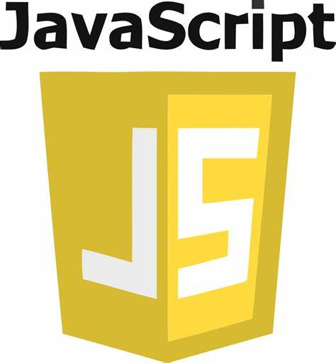
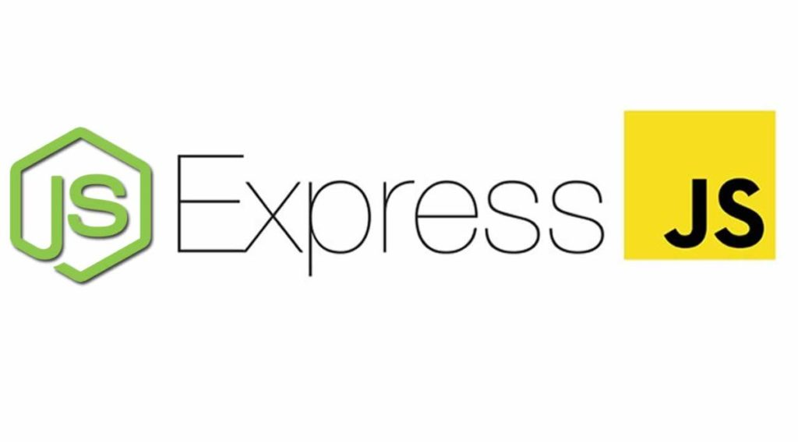
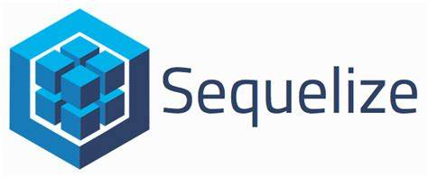
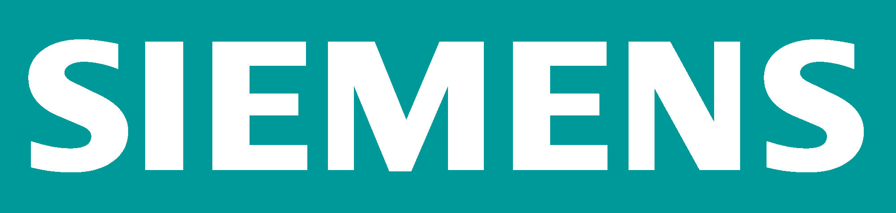
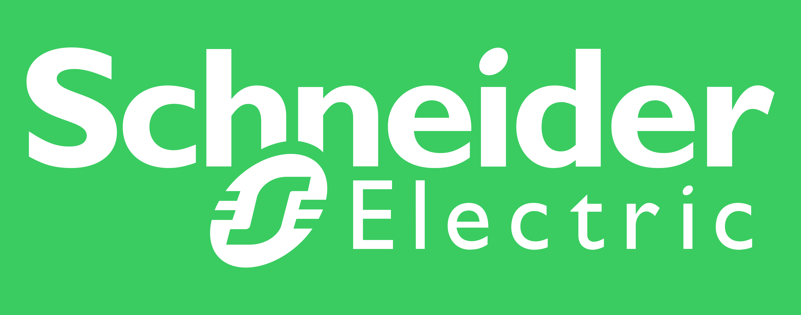
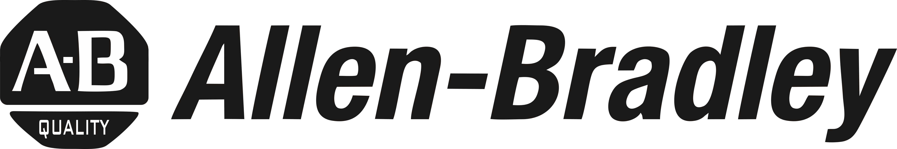
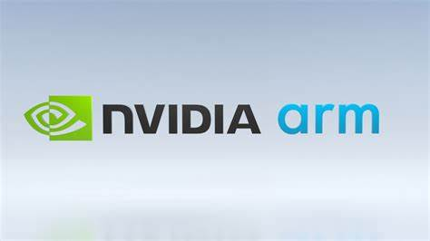
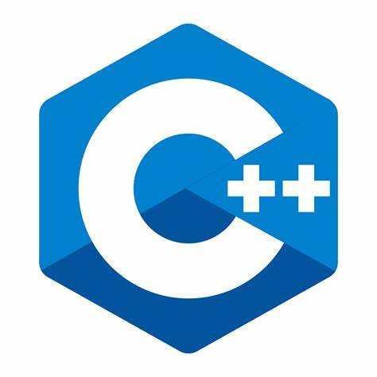
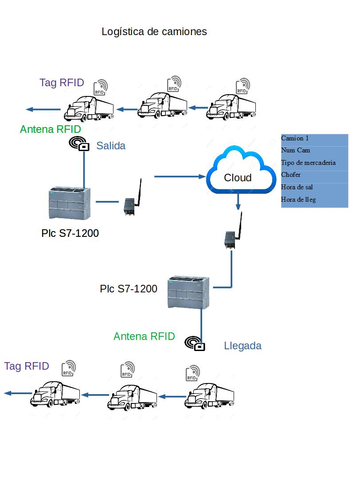
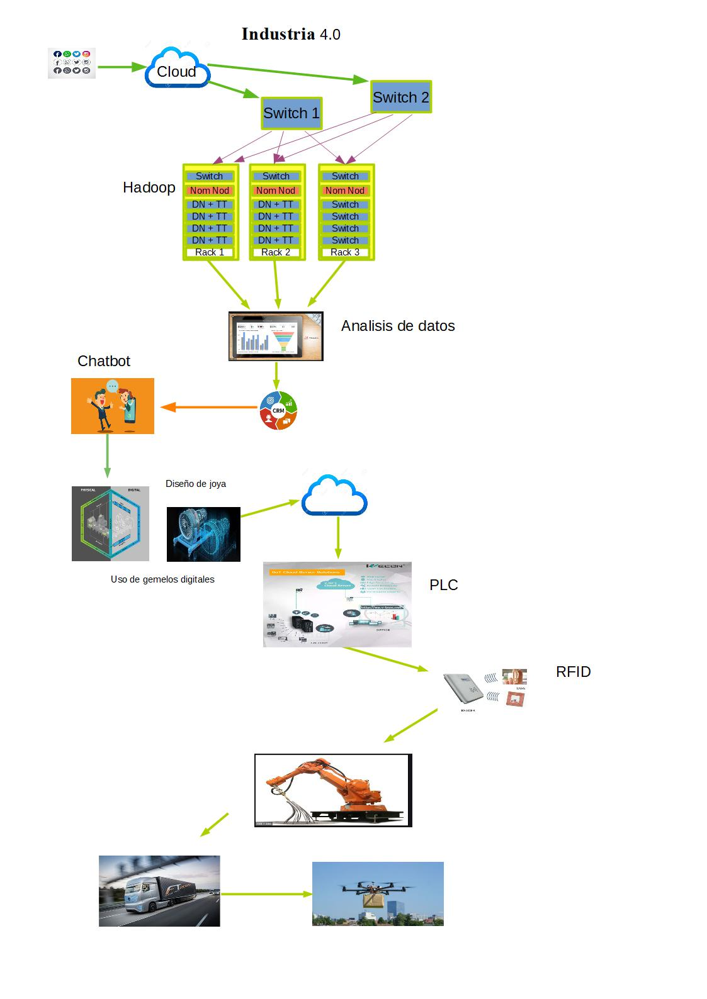

#  Luis Sergio Valdivia

## Table of contents

* [Developer](#Developer)
    * [Puedes encontrarme en](#technologies)
    * [Descripcion personal](#setup)
* [Tecnologias](#tecnologias)
  *  [Tecnologias Web](#web)
  *  [Tecnologias Automatismo](#automatismo)
   * [Tecnologias Industria 4.0](#industria40)
  
* [Proyectos](#proyecto)
  *  [Proyecto Web](#proyecto-web)
  *  [Proyecto Automatismo](#proyecto-automatismo)
  *  [Proyecto Industria 4.0](#proyecto-industria40)
#
## Developer 

### Puedes encontrarme en:

* [luis_sergio_valdivia@hotmail.com](#email)
* https://www.linkedin.com/in/luissergiovaldivia

### Descripcion personal

 Hola mi nombre es Sergio, soy un desarrollador  Full Stack Developer Web y de Automatismos Industriales. Realize un Diplomatura en Industria 4.0 en la UTN Facultad Reginal Resistencia. Estoy viviendo en Cordoba Argentina y me gusta desarrollar sitios web que puedan ayudarte a resolver tus problemas.
 Me he formado y especializado en el Bootcamp de soyHenry, además de trabajar durante veinte años como programado de automatismo en la Industria Automotriz de Argentina y Brasil.
 En el automatismo comence a programar plc de la marca Siemens Step 5, y lod PL7-3 de la marca Telemecanique. Seguido por la evolucion de la tecnologia continue con la programacion de Siemens Simatic S7-300 y S7-400 en el caso de Siemens y PL7-pro en Schneider. Hoy en dia realice una capacitacion en Tia Portal.
 En cuanto a developer Full Stack Developer manejo las tecnologias de Javascript,
 React.js, Node.js, express and sequelize.
 Realize el secundario tecnico el cual al terminar los seis años de cursado se me dio el titulo de Tecnico Electronico Indutrial. Me inscri en la UTN (Universidad Tecnologia Naciona Reginal Cordoba) y realize en cursado de Ingeniria Electronica la cualla cual curse hasta quinto año y teniendo aproba el cuarto año. 
 

#
###  Tecnologias 

#### Tecnologias Web

* Javascript
* React.js
* Node.js 
* Express.js
* SequeliZe.js      

#### Tecnologias Automatismo

* Siemens Tia Portal
* Siemens Simatic Step 7
* Migracion de Siemens Step 5 a S7 o Tia Portal
* Schneider PL7-Pro
* Allen Bradley
* Microcontrolador Pic y ARM
* Lenguaje C/C++

#### Tecnologias Industria 4.0

* TECNOLOGÍAS FACILITADORAS Y SISTEMAS
CIBER-FÍSICOS
* TRANSFORMACIÓN DIGITAL EN EMPRESAS
* CLOUD COMPUTING, LA NUBE
* BIG DATA, OPEN DATA Y DATA ANALYTICS
* INTERNET DE LAS COSAS Y SMART CITIES
* INTELIGENCIA ARTIFICIAL APLICADA
* ROBÓTICA COLABORATIVA - COBOTS
* CIBERSEGURIDAD INDUSTRIAL
* FABRICACIÓN ADITIVA, IMPRESIÓN 3D Y 4D
* BLOCKCHAIN Y LOS NUEVOS PILARES DE LA
ECONOMÍA DIGITAL

#
### Logos de tecnologias 

#### Web

 </img> 
</img> 
</img>
</img>

#### Automatismo

#
###  Proyecto 

#### Proyecto Web
 
##### Proyecto Individual Pokemon

- Se Construyo una App utlizando React, Redux, Node y Sequelize.
- Usar y practicar testing.
- Se realizo Frontend y Backend 
- Se aprendio a consumir datos de una API y crear una data base                 propia utilizando postgresql

##### Proyecto Grupal Restorant

#### Proyecto Automatismo

-  Modificación del ciclo de funcionamiento del dispositivo de Armado General del Renault Clío 
-  Participación en Renault de la modificacion de los programas de PLC de un sistema Balanceles y trineos con referencial común.
- Proyecto de Robot de encolado de vidrios, modificación del autómata TSX 67 para un nuevo ciclo de encolado del robot. El proyecto fue monitoreado desde Renault Francia.
- Proyecto migración de PLC Conformador 207 Peugeot. El dispositivo tenia un PLC Siemenes S5-115U y se migro a un  S7-400
- Proyecto de Tranfert X65(Renault Clio tres puertas). El proyecto consistia en viajar a Brasil, realizar backup de equipos Allen-Bradley y supervisar desconeccion, y envalajes de los dispositivos. Aqui en Argentina se re-conficura la red y se pone en marcha los dipositivo.
- Se realiza programa (Siemens S5) para nuevas mesas de inspección en la área de hornos en la planta de Peuget - Citroen incluye la automatización de las mismas.
- Migración de autómata de maquina encargada de carga de 
  fluidos en vehiculo de la empresa Renault. Se realiza la migracion de un TSX 57 a un Pl7-pro
- Colocación de autómata de supervisión en  Horno Autoclave perteneciente a la empresa Lockeed Matin (hoy Fadea -fabrica de aviones-)

 #### Proyecto Industria 4.0 

 ##### Logistica de camiones
- En este proyecto de caracter teorico se realiza el control del ingreso, salida, carga y conductor de camiones de carga logistica.    

##### Joyeria 4.0
- En este nuevo proyecto el cliente realiza la compra de una joya a una joyeria 4.0
El cliente cominza con elegir un diseño he implemerlo en modo virtual, luego la solicita y la compra y espera la misma en su  casa para su envio.

  - Importancia de las redes y web que puedan captar clientes
  - Uso de la nube o cloud para la adquisiscion de datos
  - Implemtacion de analisis de datos
  - Implematacion de gemelos digitales
  - robotica en la fabicacion del producto
  - logistica autonoma vehiculos y drones

 
   
    
  
  
   
     
    
   
   

